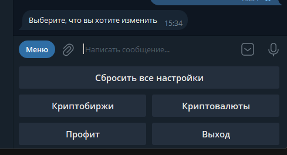
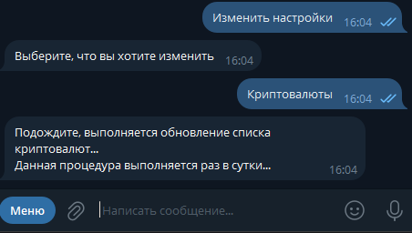
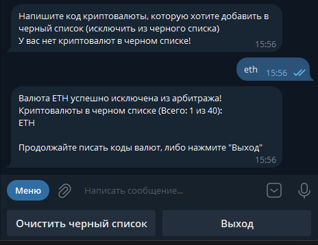
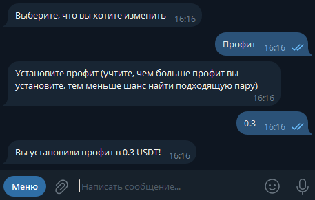
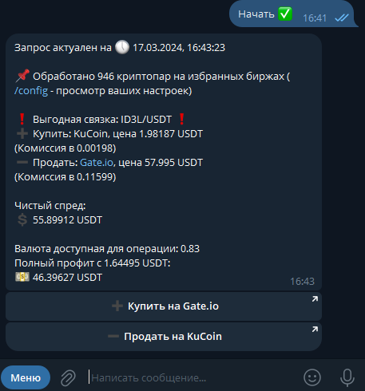
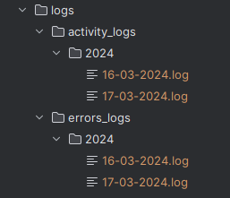
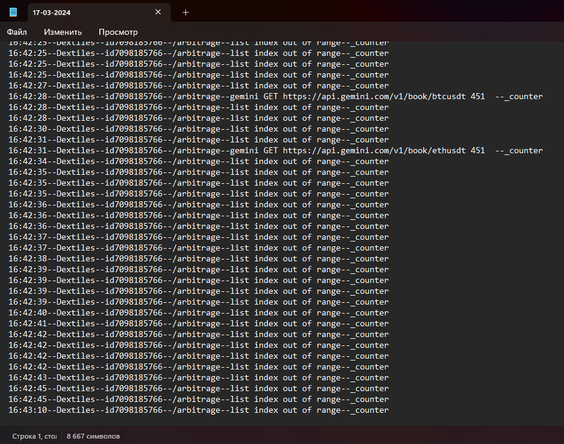
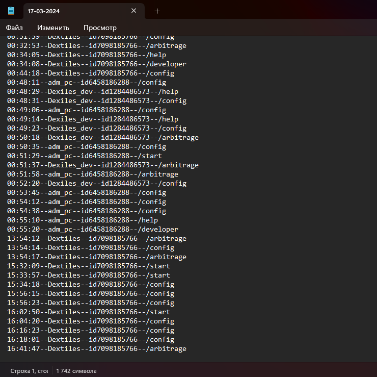

# Телеграм-бот _криптовалютной аналитики_ (арбитража)
Это бот, который предоставляет информацию и анализ в режиме реального времени о различиях в ценах на криптовалюту на нескольких биржах. Бот сканирует различные рынки криптовалюты, чтобы выявить возможности покупки криптовалюты по более низкой цене на одной бирже и продажи по более высокой цене на другой бирже. Используя эти различия в ценах, пользователи могут потенциально получить прибыль от арбитражной торговли.
## Принцип работы:
1. Анализ рынка: Изучение цен на криптовалюты на различных биржах и поиск разницы в ценах.
2. Выбор оптимальных торговых пар: Определение пар криптовалют, на которых возможно осуществить арбитражную сделку.
3. Выполнение операций: Покупка криптовалюты на одной бирже по более низкой цене и ее продажа на другой бирже по более высокой цене.
4. Учет комиссий: Учет комиссий бирж и расчет прибыли с учетом затрат на транзакции.
5. Мониторинг и автоматизация: Постоянное отслеживание рынка и автоматизированное выполнение операций для максимизации выгоды.
## Возможные риски:
1. Волатильность рынка: Криптовалюты известны своей высокой волатильностью, что может привести к значительным изменениям цен и потере капитала.
2. Ликвидность: Некоторые криптовалютные биржи могут иметь низкую ликвидность, что затрудняет покупку и продажу активов по желаемым ценам.
3. Технические проблемы: Технические сбои, взломы или другие проблемы на криптовалютных биржах могут привести к потере доступа к активам или деньгам.
4. Регуляторные риски: Регулирование криптовалютной индустрии по-прежнему развивается и может влиять на легальность и регуляторные требования для криптовалютных операций.
5. Недостаточная информация: Недостаточное понимание рынка и стратегий арбитража может привести к неправильным инвестиционным решениям и убыткам.

>  Бот берет на себя все расчеты, а так же сводит до минимума всевозможные риски

## Поддерживаемые биржи:
В совокупности телеграмм бот умеет работать со всеми криптобиржами, имеющими API и поддерживающими HFT, у каждого пользователя будет свой индивидуальный установленный набор настроек, сохраненный в базе данных, привязанный к id
### Базовые биржи:
<table>
<tr><th>№</th><th>Наименование</th><th>Ссылка на биржу</th></tr>
<tr><th>1<th>Binance</th><th>https://www.binance.com</th></tr>
<tr><th>2</th><th>ByBit</th><th>https://www.bybit.com</th></tr>
<tr><th>3</th><th>OKX</th><th>https://www.okx.com</th></tr>
<tr><th>4</th><th>KuCoin</th><th>https://www.kucoin.com</th></tr>
<tr><th>5</th><th>UpBit</th><th>https://www.upbit.com</th></tr>
<tr><th>6</th><th>Gate.io</th><th>https://www.gate.io</th></tr>
<tr><th>7</th><th>Gemini</th><th>https://www.gemini.com/</th></tr>
<tr><th>8</th><th>Coinbase</th><th>https://www.coinbase.com</th></tr>
<tr><th>9</th><th>Crypto.com</th><th>https://crypto.com</th></tr>
</table>

## Оглавление:
### 1. Развертывание
### 2. Настройка
### 3. Арбитраж
### 4. Логирование
### 5. Дополнение

## 1. Установка бота
1. Клонировать себе репозиторий
2. Создать файл __.env__ в корне проекта и поместить в него токен бота, который можно получить от __@BotFather__
> BOT_TOKEN="ВАШ_ТОКЕН"
3. Теперь необходимо запустить исполняемый файл __main.py__

## 2. Настройка _(Ключ к успеху: Правильно настроенный бот: Правильно настроенный бот - богатство в доме)_
Для настройки бота используйте команду
> /config

Доступны режимы настройки:

### Биржи, криптовалюты и профит - основные ключевые параметры, доступные для настройки

  
Меню

  

- Биржи (от 3 до 9 бирж могут быть использованы для арбитража. Чтобы добавить\убрать биржу из списка, достаточно нажать кнопку, соответствующую ее названию)

  
Биржи

  

- Черный список криптовалют (позволят исключить до 40 криптовалют, они не будут учитываться при арбитраже. Чтобы включить в список или исключить - необходимо написать код нужной криптовалюты, актуальность обновляется раз в сутки при первом запросе. Если вы попытаетесь добавить несуществующую валюту, вы получите соответсвующее об этом уведомление)

  
Криптовалюты

  
  

- Профит (минимальное значение положительной прибыли. Учтите! чем больше значение, тем ниже шанс провести удачный арбитраж. Учтите, знак разделителя должен быть ".")

  
Профит

  

#### После успешной настройки инструмента под себя, вы готовы провести арбитраж!

## 3. Арбитраж _(то, ради чего мы все здесь собрались)_
Для запуска раздела арбитража используйте команду
> /arbitrage

После чего необходимо дождаться сообщения с результатом обработки
В сообщении будут ссылки на криптобиржы, однако учтите, в случае ошибок их может не быть. Для получения подробностей необходимо смотреть log-файлы

  
Результат арбитража

  

## 4. Логирование
Логирование - это процесс записи информации о работе программы в специальные файлы, называемые логами. Логи могут содержать различные сведения, такие как ошибки, предупреждения, информационные сообщения и другую отладочную информацию. Логирование помогает разработчикам отслеживать работу приложения и выявлять проблемы.

В директории телеграмм-бота логи разбиваются на два раздела: об ошибках и действия пользователей, все логи группированы по папкам с годами и отфильтрованы по дням

  
Иерархия

  

> logs/errors_logs - папка с логами об ошибках
> 
> Каждая запись в логе имеет следующее представление:
>
>> Время--Ник(пользователе)--id(пользователе)--Команда--Описание ошибки--метод в программе
> 

>  
Пример лог-фала с ошибками

>  
> 

> logs/activity_logs - папка с логами о действия пользователей
> 
> Каждая запись в логе имеет следующее представление:
>
>> Время--Ник(пользователе)--id(пользователе)--Команда
> 

>  
Пример лог-фала с активностью пользователя

>  
> 

## 5. Дополнение
### Дополнительные команды, присутствующие в данном сервисе
> /help - обзор всех команд бота

> /developer - информация о разработчике